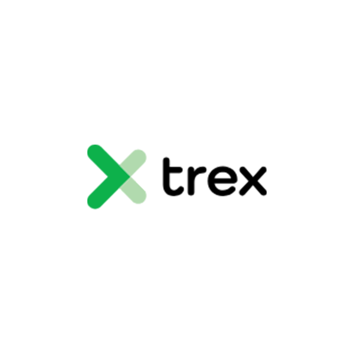

<div align="center">



# TREX TWIN

### Dijital Üretim Takibi, Fabrika Analitiği ve Yapay Zekâ Destekli Karar Destek Sistemi

**Flutter • Provider • Google Gemini • Speech-to-Text • Text-to-Speech • Yerel Üretim Simülasyonu**

</div>

---

## 📌 Proje Hakkında

**TREX TWIN**, üretim hatlarının operasyonel durumunu tek bir arayüz üzerinden takip etmek, üretim performansını analiz etmek ve fabrika yönetimine karar desteği sağlamak amacıyla geliştirilmiş Flutter tabanlı bir dijital üretim prototipidir.

Uygulama; üretim miktarı, planlanan üretim, hurda (scrap), hat hızı, duruşlar ve **OEE (Overall Equipment Effectiveness)** bileşenlerini izler. Bunun yanında personel takibi, vardiya takvimi, liderlik tabloları, fabrika içi sosyal akış ve yapay zekâ destekli analiz özellikleri sunar.

Proje içerisinde gerçek zamanlı sisteme benzer davranış oluşturmak için yerel bir **fabrika simülasyon katmanı** bulunmaktadır. Simülasyon verileri uygulama içinde güncellenebilir ve cihaz üzerinde saklanabilir.

---

## 🎬 Demo Videosu

Projeyi çalışırken görmek için:

**[▶ TREX TWIN Demo Videosunu İzle](docs/demo/trex-twin-demo.mp4)**


---

## 📸 Ekran Görüntüleri

### Giriş Ekranı

<p align="center">
  
</p>

Kullanıcı, çalışan kimliği ve parola ile sisteme giriş yapabilir. **Remember Me** seçeneği sayesinde oturum bilgileri cihaz üzerinde saklanabilir.

### Üretim Hatları

<p align="center">
  
</p>

Her üretim hattı için üretim durumu, planlanan ve gerçekleşen üretim, kalan miktar, hurda, anlık hız, duruş süresi ve OEE bileşenleri görüntülenebilir.

### Fabrika Durumu ve AI Insight

<p align="center">
  
</p>

Sistem; çalışan ve duran hatları, uzun süreli duruşları, planlı/plansız duruşları ve kritik olayları özetler. Yapay zekâ destekli **Factory Assistant Insight**, mevcut operasyonel tabloyu yorumlayarak kullanıcıya kısa bir karar desteği sunar.

### Factory Feed

<p align="center">
  
</p>

Fabrika içi güncellemeler, üretim hattı hikâyeleri, paylaşımlar ve performans odaklı içerikler tek bir akışta görüntülenebilir.

### Liderlik Tablosu

<p align="center">
  
</p>

Hatlar ve personel; günlük, haftalık, aylık ve yıllık dönemlerde performans göstergelerine göre karşılaştırılabilir.

### Personel Yönetimi

<p align="center">
  
</p>

Personel ekranında aktif çalışanlar, izinli personel, kritik devamsızlık, atanan üretim hattı, vardiya ilerlemesi, üretim, hurda, OEE ve duruş bilgileri takip edilebilir.

### Vardiya ve Devam Durumu

<p align="center">
  
</p>

Seçilen personelin aylık/yıllık çalışma, izin ve devamsızlık istatistikleri görsel olarak incelenebilir.

### Vardiya Takvimi

<p align="center">
  
</p>

Gündüz vardiyası, gece vardiyası, izin, devamsızlık ve haftalık izin günleri takvim üzerinden görüntülenebilir.

---

## ✨ Temel Özellikler

- 🏭 **Canlı üretim hattı izleme**
- 📊 **OEE, Availability, Performance ve Quality takibi**
- 🎯 **Planlanan / gerçekleşen üretim karşılaştırması**
- ⚡ **Anlık üretim hızı takibi**
- 🗑️ **Scrap / hurda analizi**
- ⏱️ **Planlı ve plansız duruş takibi**
- 📈 **Saatlik üretim trendleri**
- 🧠 **Google Gemini tabanlı yapay zekâ analizleri**
- 🎙️ **Sesli komut ve doğal dil etkileşimi**
- 🔊 **Text-to-Speech ile sesli geri bildirim**
- 👨‍🏭 **Yönetici ve operatör rolleri**
- 👥 **Personel performansı ve vardiya yönetimi**
- 🗓️ **Vardiya / devam takvimi**
- 🏆 **Hat ve personel liderlik tabloları**
- 📰 **Factory Feed ve sosyal akış**
- 🔔 **Uygulama içi kritik durum bildirimleri**
- 🌙 **Dark / Light tema desteği**
- 💾 **SharedPreferences ile yerel veri saklama**
- 🧪 **Yerel fabrika üretim simülasyonu ve geçmiş veri üretimi**

---

## 🤖 Yapay Zekâ ve Sesli Asistan

TREX TWIN içerisinde Google Gemini tabanlı bir yapay zekâ katmanı bulunmaktadır.

Sistem; fabrika verilerini kullanarak şu alanlarda analiz ve yanıt üretebilir:

- Genel fabrika durumu
- OEE ve KPI analizi
- Üretim trendleri
- Duruş ve kayıp analizi
- Hurda / kalite analizi
- Hedef sapmaları
- Personel performansı
- Hat bazlı analizler
- Doğal dilde fabrika soruları

Sesli asistan tarafında `speech_to_text` ile konuşma algılama ve `flutter_tts` ile sesli cevap üretimi kullanılmaktadır.

Örnek kullanım senaryoları:

```text
"Dashboard'u aç"
"Line 2 durumunu göster"
"OEE analizi yap"
"Personel ekranını aç"
"Shift calendar'ı göster"
"Line 4'ü durdur"
"Scrap miktarını artır"
```

---

## 📊 Takip Edilen Üretim Metrikleri

| Metrik | Açıklama |
|---|---|
| Produced | Gerçekleşen üretim miktarı |
| Planned | Planlanan üretim miktarı |
| Remaining | Hedefe kalan üretim |
| Scrap | Hurda / hatalı üretim |
| Instant Speed | Anlık üretim hızı |
| Availability | Kullanılabilirlik |
| Performance | Performans |
| Quality | Kalite oranı |
| OEE | Toplam ekipman etkinliği |
| Stoppage | Duruş süresi ve nedeni |
| Hourly Production | Saatlik üretim trendi |

OEE, uygulamada temel olarak şu üç bileşenden türetilir:

```text
OEE = Availability × Performance × Quality
```

---

## 🧱 Proje Yapısı

```text
lib/
├── main.dart
├── factory_simulation_service.dart
│
└── features/
    └── home/
        ├── view/
        │   ├── home_view.dart
        │   ├── login_view.dart
        │   │
        │   ├── sub_views/
        │   │   ├── dashboard_view.dart
        │   │   ├── analytics_view.dart
        │   │   ├── analytics_shared.dart
        │   │   ├── personnel_view.dart
        │   │   └── social_view.dart
        │   │
        │   └── widgets/
        │       ├── factory_line_card.dart
        │       ├── charts_and_trends.dart
        │       ├── home_bottom_bar.dart
        │       ├── home_header.dart
        │       ├── in_app_notification_overlay.dart
        │       ├── leaderboard_widgets.dart
        │       ├── line_analytics_views.dart
        │       ├── line_details_modals.dart
        │       ├── line_dialogs.dart
        │       └── shift_calendar_view.dart
        │
        └── view_model/
            ├── home_view_model.dart
            └── login_view_model.dart
```

Proje, **Provider** tabanlı state management ile View / ViewModel ayrımına sahip MVVM-benzeri bir yapı kullanmaktadır.

---

## 🛠️ Kullanılan Teknolojiler

| Teknoloji / Paket | Kullanım |
|---|---|
| Flutter | Uygulama arayüzü ve çoklu platform geliştirme |
| Dart | Ana programlama dili |
| Provider | State management |
| Google Generative AI | Gemini tabanlı AI analizleri |
| speech_to_text | Sesli komut algılama |
| flutter_tts | Sesli yanıt üretme |
| fl_chart | Grafik ve analitik görselleştirmeler |
| SharedPreferences | Yerel veri ve kullanıcı tercihlerinin saklanması |
| path_provider | Yerel dosya yolları |
| HTTP | Ağ istekleri için altyapı |

---

## 🚀 Kurulum

### 1. Repoyu klonlayın

```bash
git clone <REPO_URL>
cd trex_pocket_twin
```

### 2. Flutter paketlerini yükleyin

```bash
flutter pub get
```

### 3. Bağlı cihazları kontrol edin

```bash
flutter devices
```

### 4. Uygulamayı çalıştırın

```bash
flutter run
```

Belirli bir platformda çalıştırmak için örnek:

```bash
flutter run -d chrome
```

veya:

```bash
flutter run -d windows
```

---

## 🔐 Gemini API Anahtarı

Yapay zekâ özelliklerini kullanabilmek için bir Gemini API anahtarı gerekir.

**API anahtarını doğrudan kaynak kodun içine yazmayın ve GitHub'a göndermeyin.**

Önerilen yöntemlerden biri `--dart-define` kullanmaktır:

```dart
const geminiApiKey = String.fromEnvironment('GEMINI_API_KEY');
```

Uygulamayı çalıştırırken:

```bash
flutter run --dart-define=GEMINI_API_KEY=YOUR_API_KEY
```

> Eğer bir API anahtarı daha önce public bir repoya gönderildiyse, eski anahtarı iptal edip yeni bir anahtar oluşturmanız önerilir.

---

## 💾 Veri ve Simülasyon

Uygulamanın fabrika simülasyon katmanı:

- Günlük üretim verilerini yönetir.
- Saatlik üretim değerlerini oluşturur ve günceller.
- Üretim hattı çalışırken üretim miktarını artırır.
- Duruş başlangıç/bitiş zamanlarını kaydeder.
- Duruş nedenlerini ve sürelerini takip eder.
- Hurda miktarını günceller.
- Geçmiş üretim verileri oluşturabilir.
- Uygulama kapalı kaldığında geçen süreyi hesaba katarak üretim verisini güncelleyebilir.
- Verileri cihaz üzerinde saklayabilir.

Başlangıç simülasyon verisi:

```text
assets/factory_simulation.json
```

---

## 👤 Kullanıcı Rolleri

### Manager

Yönetici rolü fabrika genelini görüntüleyebilir ve farklı üretim hatlarını, personeli, analizleri ve kritik durumları takip edebilir.

### Operator

Operatör rolü kendi atandığı üretim hattı ve vardiya bilgilerine odaklanan bir kullanım deneyimine sahiptir.

---

## 📱 Ana Modüller

```text
Dashboard
   ↓
Production Lines
   ↓
Analytics
   ↓
Factory Feed / Leaderboard
   ↓
Personnel
   ↓
Shift Calendar
   ↓
AI + Voice Assistant
```

---

## 🧪 Proje Durumu

Bu proje şu anda bir **dijital üretim / smart factory prototipi ve simülasyon uygulaması** olarak geliştirilmektedir.

Gerçek fabrika ortamına bağlanmadan önce aşağıdaki alanların üretim ortamına uygun hâle getirilmesi gerekir:

- Gerçek kullanıcı doğrulama sistemi
- Güvenli API yönetimi
- Backend / veritabanı entegrasyonu
- Gerçek makine, PLC veya IoT veri bağlantıları
- Yetkilendirme ve rol güvenliği
- Loglama ve hata takibi
- API anahtarlarının güvenli yönetimi

---

## 📂 README Medya Klasörleri

Ekran görüntülerini ve videoyu aşağıdaki yapıda tutabilirsiniz:

```text
docs/
├── screenshots/
│   ├── 01-giris.png
│   ├── 02-uretim-hatlari.png
│   ├── 03-fabrika-durumu.png
│   ├── 04-factory-feed.png
│   ├── 05-liderlik-tablosu.png
│   ├── 06-personel.png
│   ├── 07-vardiya-ozeti.png
│   └── 08-vardiya-takvimi.png
│
└── demo/
    └── trex-twin-demo.mp4
```

---

<div align="center">

### TREX TWIN

**Akıllı Fabrika • Dijital İkiz • Üretim Analitiği • Yapay Zekâ**

</div>
